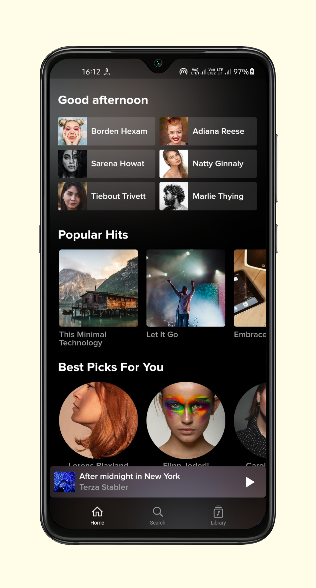
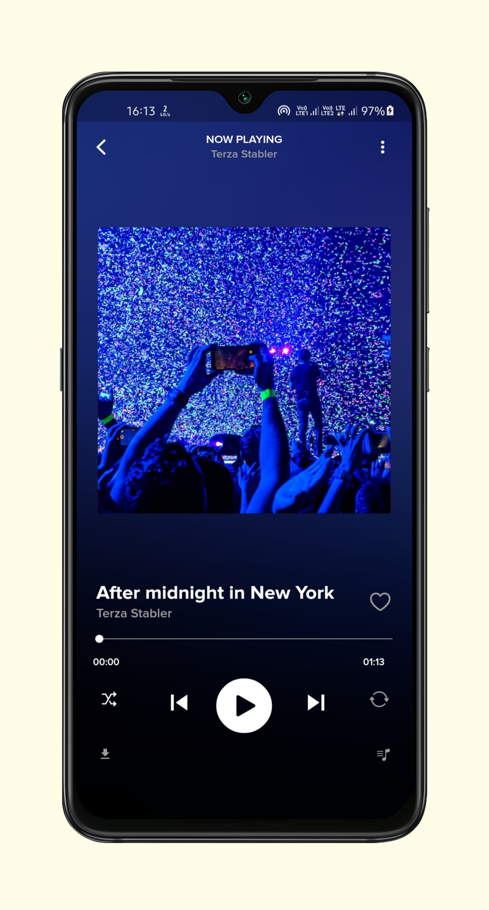
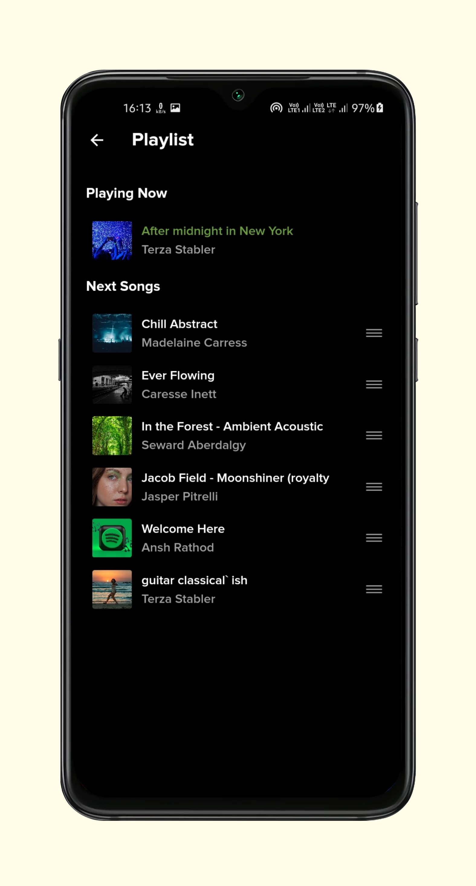
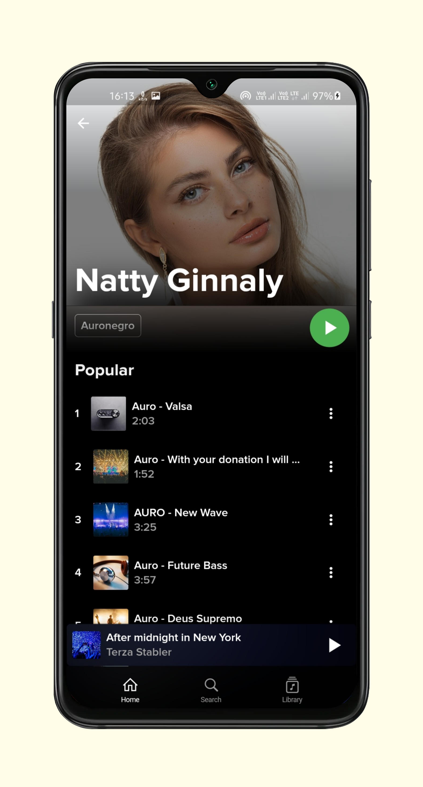
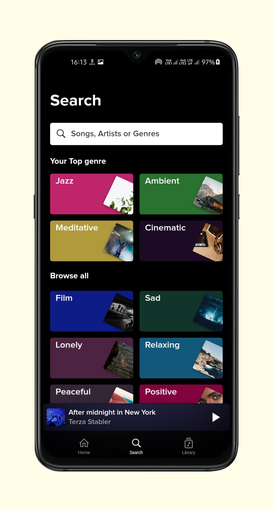
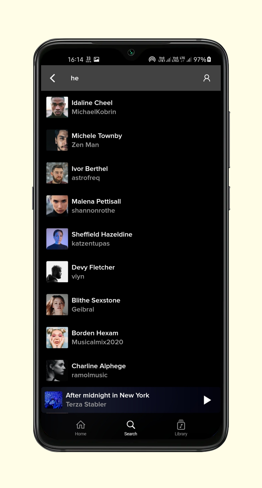
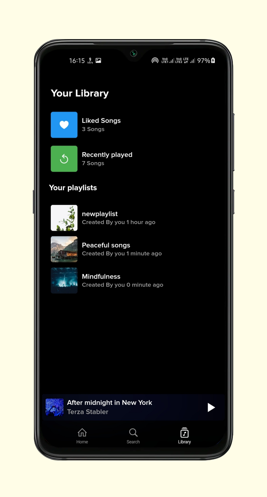
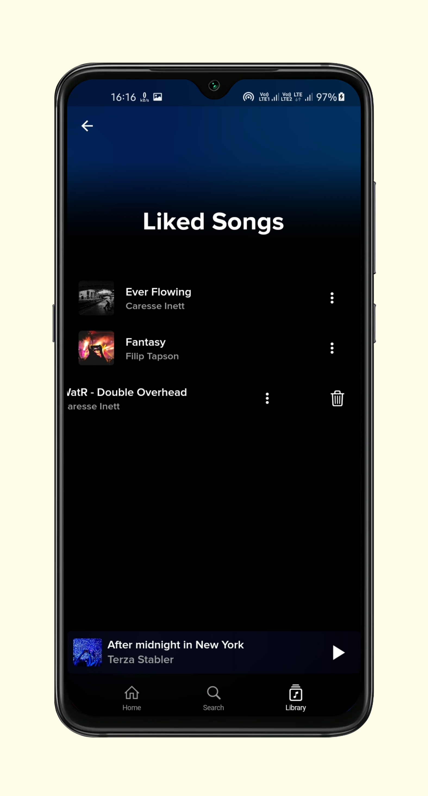
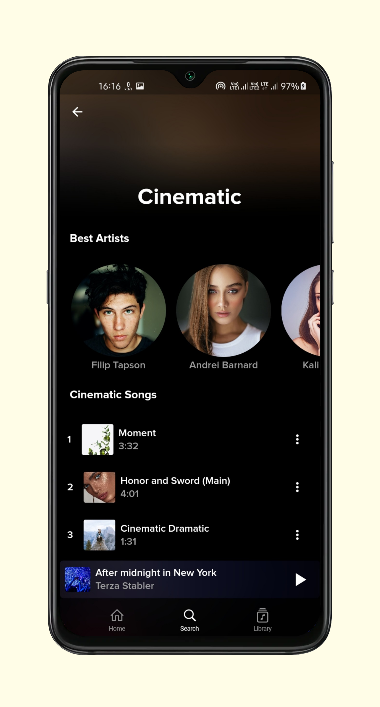

# Musive

ull-stack music player app is written in flutter and dart using node.js music API. Fully Functional music player with UI like Spotify app. Added 500+ royalty-free music and information about artists. Application users can make their own playlist or collect liked songs.

></h3>

# Features

- added 1000+ music, 300+ artists
- Queue Management
- can make a collection of liked songs.
- create/delete your own playlist.
- Spotify UI clone for the best experience.
- notification player.
- recordable list for currently playing playlist ( you can drag music to set an order for playlist).
- Cache support
- Song, Album, Artist, and Playlist Search
- Best Streaming Quality

And much more
 

## **Image Gallery**

 

## **Dependencies**

- [cupertino_icons](https://pub.dev/packages/cupertino_icons)
- [http](https://pub.dev/packages/http)
- [flutter_bloc](https://pub.dev/packages/flutter_bloc)
- [assets_audio_player](https://pub.dev/packages/assets_audio_player)
- [hive_flutter](https://pub.dev/packages/hive_flutter)
- [cached_network_image](https://pub.dev/packages/cached_network_image)
- [url_launcher](https://pub.dev/packages/url_launcher)
- [line_icons](https://pub.dev/packages/line_icons)
- [provider](https://pub.dev/packages/provider)

